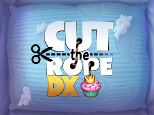
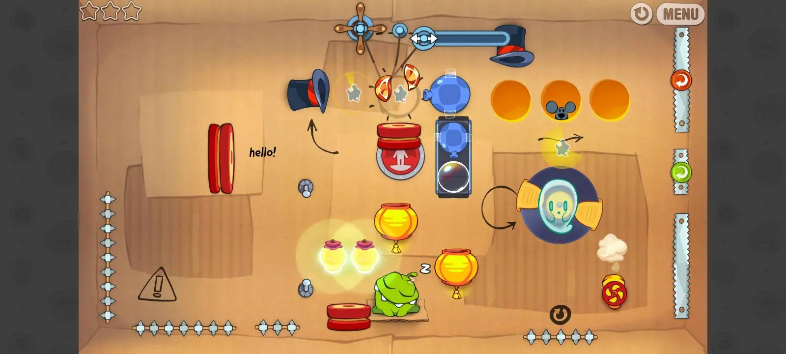

# Cut the Rope DX Extended

a fork with additional export platforms! it isn't recommended for general use. it might also become outdated compared to the real DX.

the original logo is designed by Bingies24 and darealmrcatz.

> [!NOTE]
> these projects are not, and will never be affiliated with or endorsed by ZeptoLab. all rights to the original game and its assets belong to ZeptoLab.

-------

## ds

<p align="center">
  
</p>

*Cut the Rope DX for Nintendo DS* is a C++ port! it fits into **4mb of RAM** and also runs in DSi mode. <br>

#### features

- stylus controls
- upper screen with a view of the level above, along with stars & score
- an "unlock all" option in settings. turning this on switches the game to a separate save profile to not ruin your real progress for the main game.
- progress and settings in `/ctrdx/` (on writable homebrew storage)

#### building

the build scripts are for **windows** (also requires python 3.12, powershell and 7-zip installed), and .NET 10 SDK is also needed for the costume animation exporter..

1. clone the repository and install the asset convert dependencies:

    ```powershell
    git clone https://github.com/sogful/cuttherope-dxe.git
    cd cuttherope-dxe
    python -m pip install -r ports/ds/tools/requirements.txt
    ```

2. install the blocksds toolchain, then build:

    ```powershell
    powershell -ExecutionPolicy Bypass -File ports/ds/tools/setup.ps1
    python ports/ds/tools/build.py --assets
    ```

## roblox

a faithful luau port! it is not compiled from the usual C# projects.

- `ports/roblox/src` - runtime modules grouped by roblox service
- `ports/roblox/tests` - roblox checks and generated golden data

#### features
- an "unlock all" option in settings. turning this on switches the game to a separate save profile to not ruin your real progress for the main game.

## android

<p align="center">
  
</p>

*Cut the Rope: DXfA (Decompiled Extra for Android)* is a fork made to run the improved version of the game on mobile. <br>
with compressed textures, this port should work even on **lowend devices**! the minimum to run this game is *~2gb of RAM* and *android 5.0*. <br>
some scenes might have buttons that are difficult to press, however all actions should work instantaneously inside a level.

<table>
  <tr valign="center">
    <td align="center">
      <b>real device</b>
      <ul>
        
      </ul>
    </td>
    <td align="center">
      <b>emulator</b>
      <ul>
        
      </ul>
    </td>
  </tr>
</table>

#### features

- a "custom box" for importing levels! use the "Add Level" button to pick files with your preferred file explorer, or copy them in manually:
  - on android into `/storage/emulated/0/Android/media/page.yell0wsuit.cv.ctrdx/`,
  - on windows into `/customlevels/`. <br>
<sup>(`.xml` and somewhat `.json` supported)</sup>
- extras unlocking all boxes and noclipping in the settings. turning any cheat on switches the game to a separate save profile to not ruin your real progress for the main game.
- fullscreen + widescreen letterboxing, should hopefully work well on MIUI.

#### building

the android project is at `src/CutTheRopeDX.Android/CutTheRopeDX.Android.csproj`. its compressed assets are restored from the merged android history instead of being duplicated in the current tree.

1. install the [.NET 10 SDK](https://dotnet.microsoft.com/en-us/download/dotnet/10.0), and add the android workload:

    ```bash
    dotnet workload install android
    ```

    also install the android sdk, preferrably through [android studio](https://developer.android.com/studio) and point ``ANDROID_HOME`` at it!

2. clone the repository with its full history:

    ```bash
    git clone https://github.com/sogful/cuttherope-dxe.git
    cd cuttherope-dxe
    ```

3. restore the android assets and build with the scripts in `/ports/android/tools/`:

    ```bash
    pwsh ports/android/tools/restore-assets.ps1
    ```

    - on **windows**: the `.bat` files
    - on **macos / linux**: the `.sh` files<br>
      <sup>(make them runnable first with `chmod +x ports/android/tools/*.sh`)</sup>

    all build outputs will go to `/ports/android/tools/bin/`. you'll also hear a beep when building is finished. <br>
    do note that building for android is *VERY* slow.
