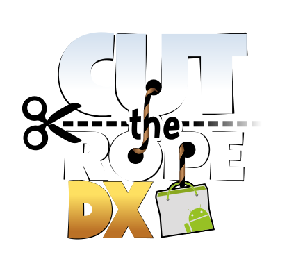

<p align="center">
  
</p>

_Cut the Rope: DXfA (Decompiled Extra for Android)_ is a fork made to run the improved version of the game on mobile.


The original logo was designed by Bingies24 and darealmrcatz.

> [!NOTE]
> This project is not, and will never be affiliated with or endorsed by ZeptoLab. All rights to the original game and its assets belong to ZeptoLab.

## Download

Download the latest release from the [Releases page](https://github.com/sogful/cuttherope-dxfa/releases).

## Features

- A custom box for importing custom levels! You can use the "Add level" button to use your preferred file explorer, or as an alternative you can copy files to ``/storage/emulated/0/Android/media/
- Cheats for quick level access and noclipping.

## Building

1. Ensure you have [.NET 10 or higher](https://dotnet.microsoft.com/en-us/download/dotnet/) installed on your machine.

2. Clone the repository to your PC:

    ```bash
    git clone https://github.com/sogful/cuttherope-dxfa.git
    cd cuttherope-dxfa
    ```

    You can also use [GitHub Desktop](https://desktop.github.com/) for ease of cloning.

3. Use the batch files in ``/tools/`` to build for either Android or Windows. <br>
<sup>(Windows is included for easier feature preview)</sup>