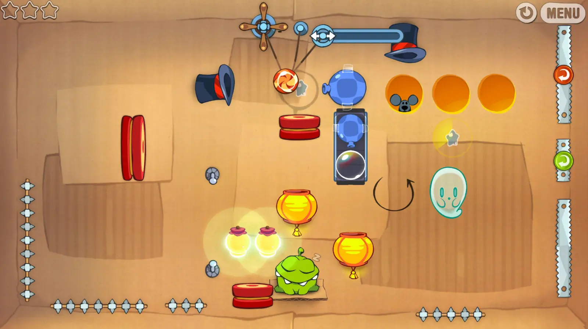

<p align="center">it's pride month!
<br> is there perhaps anything QUEER i could work on..</p>
<p align="center"></p>
<p align="center">hmm, of course, <a href="https://www.youtube.com/watch?v=y_X7X-L3n0E">that's a wonderful idea!</a></p>

<p align="center">
  
</p>

*Cut the Rope: DXfA (Decompiled Extra for Android)* is a fork made to run the improved version of the game on mobile. <br>
with compressed textures, this port should work even on **lowend devices**! the minimum to run this game is *~2gb of RAM* and *android 5.0*. <br>
this is still a heavy work in progress, some scenes might have buttons that are difficult to press, however all actions should work instantaneously inside a level.

the original logo was designed by Bingies24 and darealmrcatz.

> [!NOTE]
> this project is not, and will never be affiliated with or endorsed by ZeptoLab. all rights to the original game and its assets belong to ZeptoLab.

<table>
  <tr valign="center">
    <td align="center">
      <b>real device</b>
      <ul>
        
      </ul>
    </td>
    <td align="center">
      <b>emulator</b>
      <ul>
        
      </ul>
    </td>
  </tr>
</table>

## download

download the latest release from the [releases page](https://github.com/sogful/cuttherope-dxfa/releases).

## features

- a "custom box" for importing levels! use the "Add Level" button to pick files with your preferred file explorer, or copy them in manually: 
  - on android into `/storage/emulated/0/Android/media/page.yell0wsuit.cv.ctrdx/`, 
  - on windows into `/customlevels/`. <br>
<sup>(`.xml` and somewhat `.json` supported)</sup>
- extras unlocking all boxes and noclipping in the settings. turning any cheat on switches the game to a separate save profile to not ruin your real progress for the main game.
- fullscreen + widescreen letterboxing, should hopefully work well on MIUI.

## building

1. install the [.NET 9 SDK](https://dotnet.microsoft.com/en-us/download/dotnet/9.0), and add the android workload:

    ```bash
    dotnet workload install android
    ```

    also install the android sdk, preferrably through [android studio](https://developer.android.com/studio) and point ``ANDROID_HOME`` at it!

2. clone the repository:

    ```bash
    git clone https://github.com/sogful/cuttherope-dxfa.git
    cd cuttherope-dxfa
    ```

3. build with the scripts in `/tools/`:

    - on **windows**: the `.bat` files
    - on **macos / linux**: the `.sh` files<br>
      <sup>(make them runnable first with `chmod +x tools/*.sh`)</sup>

    all build outputs will go to `/tools/bin/`. you'll also hear a beep when building is finished. <br>
    do note that building for android is *VERY* slow, so to quickly test features you should try building for windows as it skips compression.